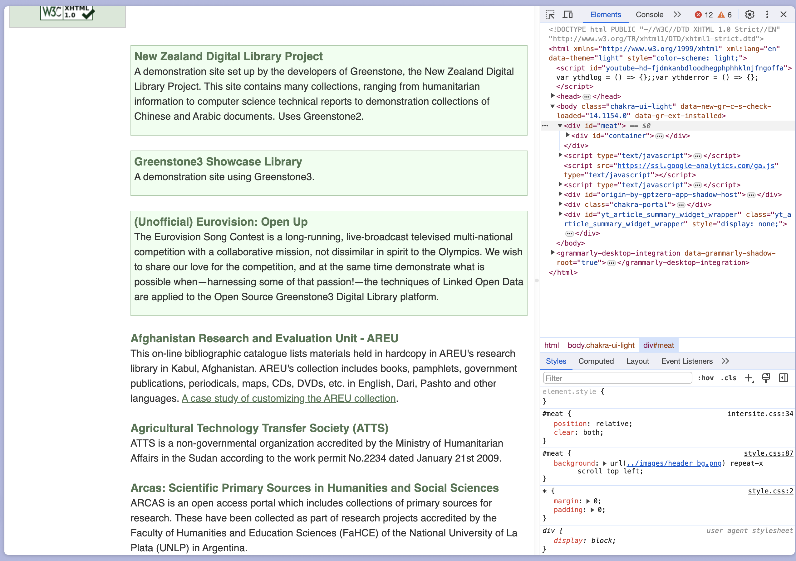

## Greenstone Digital Library Software

* open-source, multilingual software suite for building and distributing digital library collections
* developed by the New Zealand Digital Library Project at the University of Waikato. 
* The software allows for organizing information and publishing it on the web or on removable media

https://www.greenstone.org/
